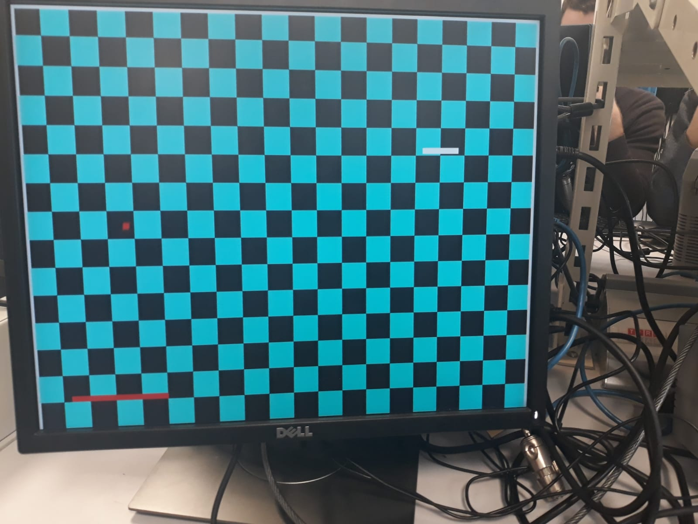
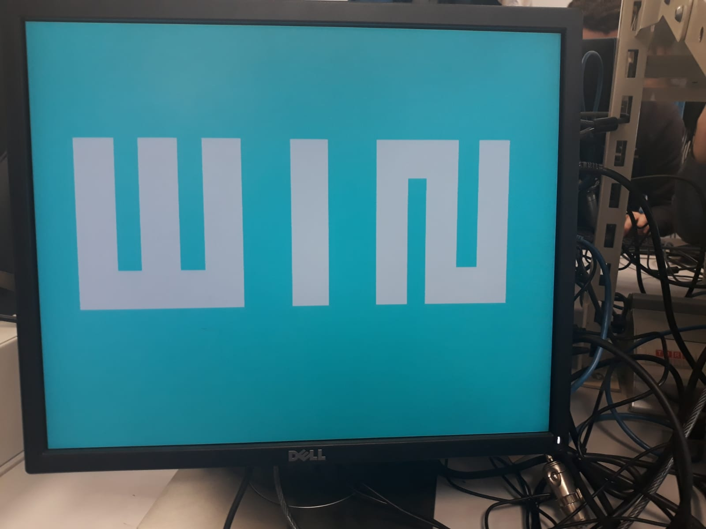

# BreakOutGame_with_VHDL
Source code for the BreakOut game implemented on FPGA "Cyclone4 DDR" with VHDL

# 1\ What's BreakOut ?

Breakout:is an arcade game developed and published by Atari, Inc., and released on May 13, 1976. It was conceptualized by Nolan Bushnell and Steve Bristow, influenced by the seminal 1972 Atari arcade game Pong, and built by Steve Wozniak, aided by Steve Jobs. By Wikipedia

  
  

# 2\ Design Schematic:

  

# 3\ How it functions ?

As show above the project is divided in many modules, I will try below to explain the main function of every module.

- Game: This module handles the game logic, loses or win, when the ball hits the boxes, and sends RGB value as to the VGA Module to display Win/Lose message.

- VGA: This module reponsible for displaying the objects, score and the final message (WIN/LOSE)

- Objects: This module sets the envirenoment for the player to play (Creates the ball, pad, moves).

- Accelerometer: We used the accelerometer of FPGA Cyclone 4, as a controller for our game to move the pad right or left using just the Y-Axes of the accelerometer.

- CompDiv: This module is used to do a clock division to FPGA signal, since it's 100Mhz and we only need 25KHz for the VGA module.

- Score: This module handles the logic of calculating number of lives for the player and display the score in the 7-segment displays.

  <video src="imgs/WhatsApp Video 2019-04-24 at 10.46.09.mp4" title="video_proof>

